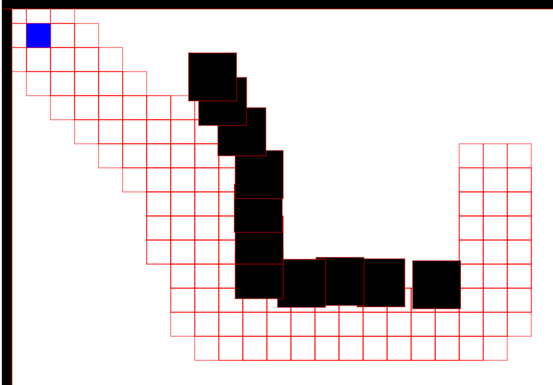

# A* Pathing Visualizer
Collision based A* pathfinding w/ stack based exploration *(because js doesn't have priority queue)*. 

## Website
https://xgarhontx.github.io/AStarPathing/

## Controls
LeftMouse: Place/Remove Blocks  
RightMouse: Start A* (hold to preview path)

## Credits
Adapted from https://medium.com/@nicholas.w.swift/easy-a-star-pathfinding-7e6689c7f7b2  
Onto to https://github.com/algorithm0r/Empty--GameEngine
